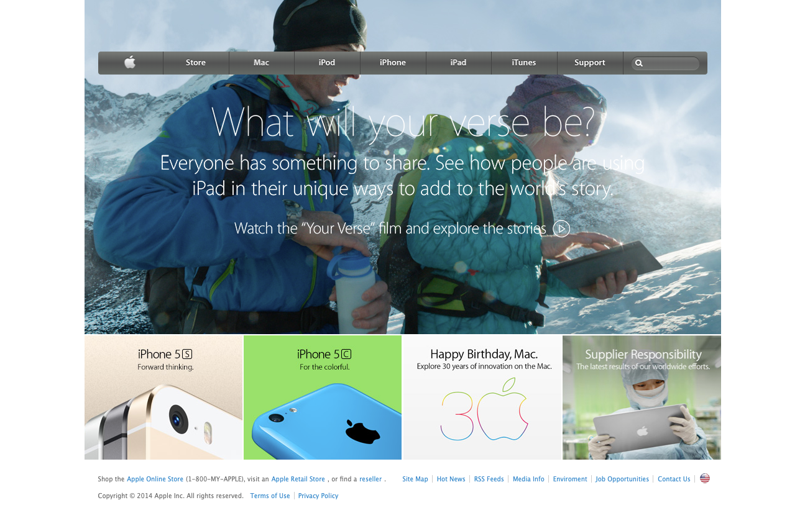

# Backgrounds and gradients

> Recreation of the 2014 apple webpage working with background, gradient and flex positioning.

This project is about creating a clone from apple company website from 2014. The project required the usage of background image management, positioning, as well as gradients to re-create the apple webpage's nab-var.

[Orignal page link](http://archive.md/UW4oR)

## Built With

- HTML5, CSS

## Live Demo

[Live Demo Link](https://canriquez.github.io/backgrounds-gradients/)

## Getting Started

To get a local copy up and running follow these simple example steps.

### No prerequisites required

### Clone/fork the repository

## Authors

👤 **Author1**

- Github: [@canriquez](https://github.com/canriquez)
- Twitter: [@cranriquez](https://twitter.com/cranriquez)
- Linkedin: [linkedin](https://www.linkedin.com/in/carlosanriquez/)

## 🤝 Contributing

Contributions, issues and feature requests are welcome!

Feel free to check the [issues page](issues/).

## Show your support

Give a ⭐️ if you like this project!

## Acknowledgments

- Thanks for the help from Ivan, Nurislam for working with me in previous projects
- Thanks for my great standup team the-corgis
- Microverse team!

## 📝 License

This project is [MIT](lic.url) licensed.
